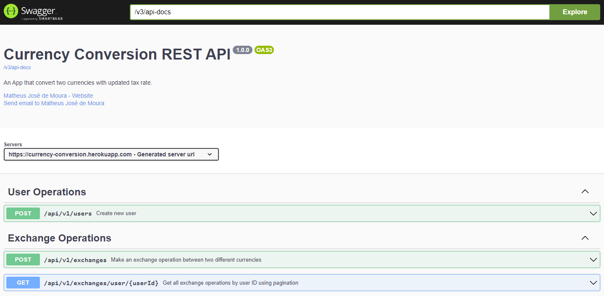
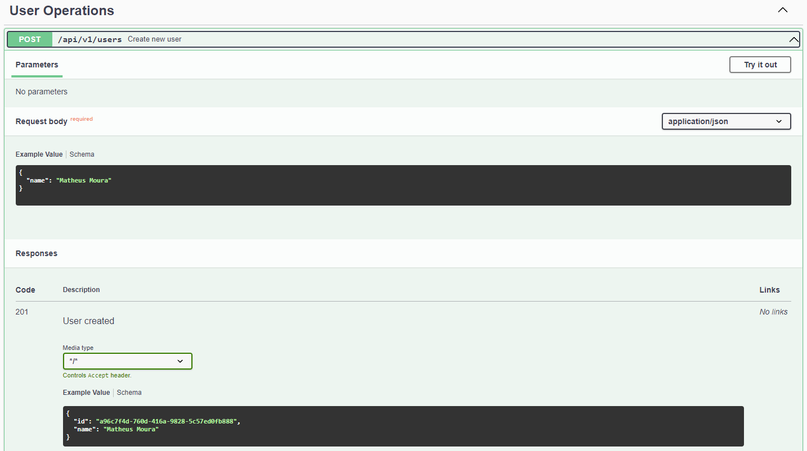
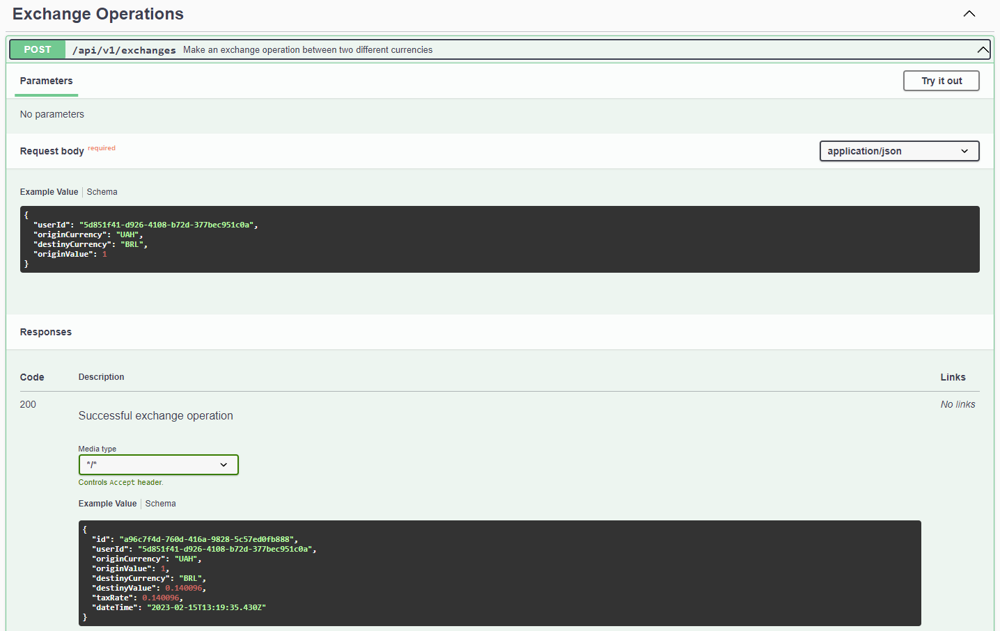
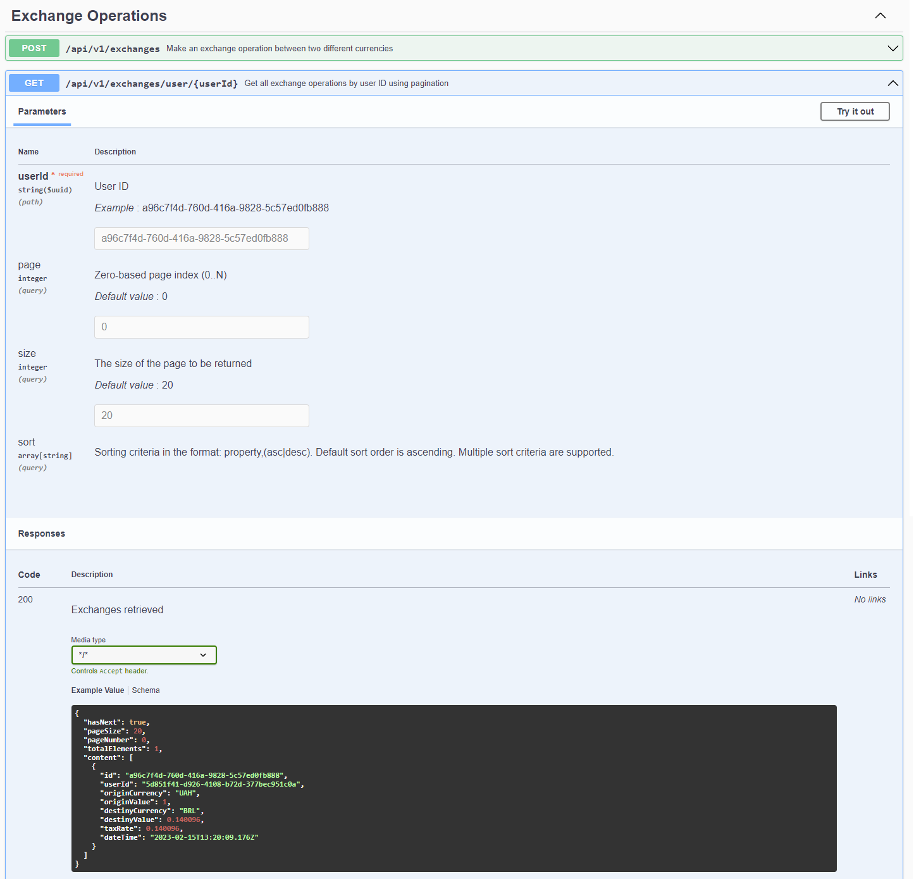

# Currency Exchange API

This API makes a currency exchange operation between two different currencies using a **Euro-based exchange tax rate**. Updated exchange rates are obtained from the **Exchange Rates Data API**.

## Exchange Rates Data API

Exchange Rates Data API has endpoints for exchange rates like updated rates, currency exchange operations, historical rates and so on.

You can check their documentation here: [Exchange Rates Data API Documentation](https://apilayer.com/marketplace/exchangerates_data-api#documentation).

This project uses only one endpoint from Exchange Rates Data API, that is the *endpoint for latest exchange rates*. The endpoint only returns the latest exchange rates with EUR as base currency. So, to make a currency exchange operation between two currencies, you have to convert the origin currency to EUR and then convert EUR to destiny currency, with respective tax rates.

In short, the formula for a currency exchange operation is:

```math
destinyValue = originValue * (\frac{destinyTaxRate}{originTaxRate})
```

This approach was done because of free plan access from Exchange Rates Data API, that let you use only EUR as base currency.

### Caching the tax rates
The project uses a free plan from Exchange Rates Data API. It returns real-time exchange rates data updated every 60 minutes, every 10 minutes, or every 60 seconds. However, this plan has a maximum limit of 250 requests per month. Therefore, the Exchange Rates Data API cannot be consumed on every new exchange operation, assuming there are more than 250 operations per month.

```math
minimumRequestRange ≅ \frac{24 hours}{(\frac{250 requests}{30 days})}
```

With that in mind, exchange rates are cached in memory and has an expiration time of 3 hours (*minimumRequestRange*). Expiration time is configurable in application properties.

```yaml
exchange-rates:
  api:
    cache:
      ttl: 5 # in hours. Minimum and default value is 3h (It will be overwritten if the typed value is less than 3)
```

---

# Running the project

You can run this project in different ways:

### Heroku

This project is hosted on Heroku. You can access project API from
this link: [Heroku](https://currency-conversion.herokuapp.com/swagger-ui.html).

### IDE

You will need:

- Java 11
- Gradle
- Your favorite Java IDE

Import the project as **gradle project** from your IDE and then, run it.

---

# Using the API

With project running on local, you can access swagger-ui from: <http:localhost:8080/swagger-ui.html/>




### User Operations

First you will have to create a use from **User Operations** POST endpoint (*/api/v1/users*). Please remember to write down the generated ID, as it is necessary to be able to carry out an exchange operation.



Request body example:

```json
{
  "name": "Matheus Moura",
}
```

If is a successful currency exchange operation, you will get this Response:

```json
{
  "id": "a96c7f4d-760d-416a-9828-5c57ed0fb888",
  "name": "Matheus Moura"
}
```

### Exchange Operations

After creating a user and having its id, you can make a currency exchange operation from **Exchange Operations** POST endpoint (*/api/v1/exchanges*).



Request body example:

```json
{
  "userId": "5d851f41-d926-4108-b72d-377bec951c0a",
  "originCurrency": "UAH",
  "destinyCurrency": "BRL",
  "originValue": 1
}
```

If is a successful currency exchange operation, you will get this Response body:

```json
{
  "id": "a96c7f4d-760d-416a-9828-5c57ed0fb888",
  "userId": "5d851f41-d926-4108-b72d-377bec951c0a",
  "originCurrency": "UAH",
  "originValue": 1,
  "destinyCurrency": "BRL",
  "destinyValue": 0.140096,
  "taxRate": 0.140096,
  "dateTime": "2023-02-15T13:55:19.693641"
}
```

You can get all exchange transactions by user from **Exchange Operations** GET endpoint (*/api/v1/exchanges/user/{userId}*).



Response:

```json
{
  "hasNext": true,
  "pageSize": 20,
  "pageNumber": 0,
  "totalElements": 1,
  "content": [
    {
      "id": "a96c7f4d-760d-416a-9828-5c57ed0fb888",
      "userId": "5d851f41-d926-4108-b72d-377bec951c0a",
      "originCurrency": "UAH",
      "originValue": 1,
      "destinyCurrency": "BRL",
      "destinyValue": 0.140096,
      "taxRate": 0.140096,
      "dateTime": "2023-02-15T13:55:19.693641"
    }
  ]
}
```

---

# Technical Notes

## Stack

This project uses the following stack:

- Java 11
- Spring Webflux
- Spring Boot 2.7.8
- Gradle

Dependencies used:

- H2 for embedded database
- Caffeine for embedded cache
- Flyway for database migration
- Swagger (OpenAPI Specification 3) for API documentation
- Mockito, WireMock, JUnit 5 and AssertJ for making test cases

## Currencies

This project supports 170 currencies.

```
AED, AFN, ALL, AMD, ANG, AOA, ARS, AUD, AWG, AZN, BAM, BBD, BDT, BGN, BHD, BIF, BMD, BND, BOB, BRL, BSD, BTC, BTN, BWP, BYN, BYR, BZD, CAD, CDF, CHF, CLF, CLP, CNY, COP, CRC, CUC, CUP, CVE, CZK, DJF, DKK, DOP, DZD, EGP, ERN, ETB, EUR, FJD, FKP, GBP, GEL, GGP, GHS, GIP, GMD, GNF, GTQ, GYD, HKD, HNL, HRK, HTG, HUF, IDR, ILS, IMP, INR, IQD, IRR, ISK, JEP, JMD, JOD, JPY, KES, KGS, KHR, KMF, KPW, KRW, KWD, KYD, KZT, LAK, LBP, LKR, LRD, LSL, LTL, LVL, LYD, MAD, MDL, MGA, MKD, MMK, MNT, MOP, MRO, MUR, MVR, MWK, MXN, MYR, MZN, NAD, NGN, NIO, NOK, NPR, NZD, OMR, PAB, PEN, PGK, PHP, PKR, PLN, PYG, QAR, RON, RSD, RUB, RWF, SAR, SBD, SCR, SDG, SEK, SGD, SHP, SLE, SLL, SOS, SRD, STD, SVC, SYP, SZL, THB, TJS, TMT, TND, TOP, TRY, TTD, TWD, TZS, UAH, UGX, USD, UYU, UZS, VEF, VES, VND, VUV, WST, XAF, XAG, XAU, XCD, XDR, XOF, XPF, YER, ZAR, ZMK, ZMW, ZWL
```

All currencies were obtained from Exchange Rates Data API.

# Problem with H2 Database console and Spring Webflux

H2 console is not only used for h2 database server browsing and database management. It can be used for all rdbms databases based on JDBC connection. H2 console application is a servlet. If the application not using servlet engine like webflux application, h2-console can not be used. Because of that restriction this autoconfiguration uses h2-console as an additional server.
H2 console is based on JDBC drivers so the driver has to in the runtime classpath. While h2-console is running as a separate serve, the spring boot application can use any r2dbc drivers, not only h2 but also any other r2dbc database drivers without running a servlet engine.

Therefore, a library for spring-boot application which is based on webflux was added. It provides features of Spring MVC h2-console for reactive spring boot app. You can check more details from this link: [Spring Boot WebFlux H2 Console](https://github.com/canyaman/spring-boot-webflux-h2-console). 
